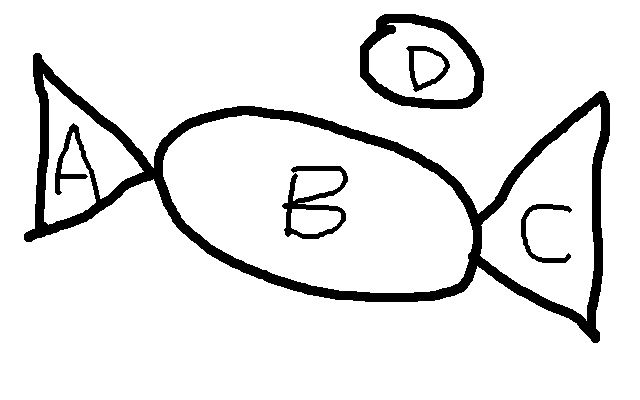
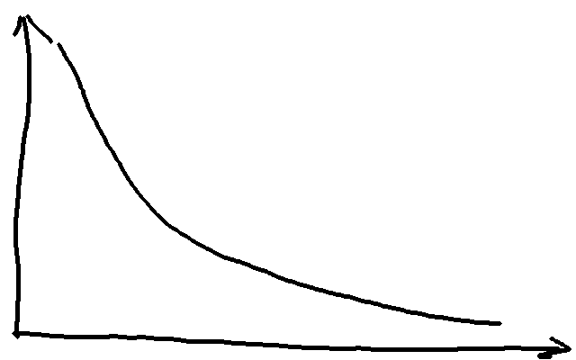

#
对CG平台的构成、增长、自组织过程的若干问题一些想法

我从来没有设计、管理过较大的社区，目前最高的水平是一个不足两千人的QQ群，也从来没有为它这么大的社区做足够的准备，有很多疑问和想法想要跟各位分享。

##聚居

城市的形成非常早，早在原始社会时期就有了巨大的城市，当时聚居并不是一个好的选择，住在城市里面的人的人均寿命非常低，更容易被传染疾病、更难以获取食物，但是人就是喜欢聚居。

##信息订阅组成的网络

把我们自己的资讯频道抽象为一些虚拟的人，我们可以看到网络由四部分构成：

1. A 信息网络中只发布信息，不订阅他人的部分

1. B 信息网络中即发布信息，又订阅他人的部分

1. C 信息网络中只订阅信息，不发布信息的部分

1. D 信息网络中既不发布信息，也不订阅信息的部分

由此我们需要注意：

1. 我们的社区是冷启动的，开始的时候没有人，需要慢慢的聚集人气，开始时我们需要自己去承担A部分的责任，否则整个网络难以形成

1. 我们需要尽可能大的B，但是B又有自己的若干问题（比如如何将新手隔离在外面），我们后面再看

1. 我们希望C由CG行业的新手组成，但是希望C提高自己的能力并向B靠拢

1. D类型的人需要认真的予以分析，将其引入B或者C

##幂律分布

CG平台每个人都可能关注若干个人（或者虚拟人），一般的社交网络中，每个人关注的人数目的分布图如下

幂律分布是无标度网络的典型特征。

由此我们需要注意：

1. 这个衰减的指数很难被改变，是人本身的特性造成的，我们需要谨慎的对待这个曲线，比如平均下来每个人只能关注10个人，引导他们关注哪10个比较好

##无标度网络

凭直觉来看，我们所有的朋友平均下来比我们更健康，比我们更有钱，比我们更幸福。很不幸，这一切都是真的。CG平台理论上也应该是一个无标度网络，原因如下：

1. 网络的规模是不断扩大的，每个月都有新的用户的加入

1. 优先连接，新的用户更倾向于关注被关注的更多的用户

由此我们需要注意：

1. 越早的用户具有越强的累积优势，我们应该提供推荐机制让后期加入的优质用户得到更多的关注

1. 后续我们会提到新浪微博因为无标度网络和人有限的社交能力的矛盾而收到的危害

1. 无标度网络对于随机故障具有很高的稳定性，对恶意攻击具有很高的脆弱性。我们应该严防垃圾、黄色、低俗信息，并对核心用户提供额外的关注，防止核心用户流失

##社交能力、注意力的上限

尽管Facebook、QQ等社交平台进行了不懈的努力，大大降低了交流的成本，但是，在任何时候，人们最多能与大约150人维持稳定的社交关系。

由此我们需要注意：

1. 社交关系的上限更可能是人脑本身结构造成的，人脑的能力非常有限，我们不应该再尝试强行扩大用户的社交圈，但可以使用六度空间（下面讲述）来辅助社交

1. 社交关系的上限非常低，而且这150个社交关系中可能包含单向的社交关系（我猜的），紧密的社交关系的上限更低，如果部分大V过大，每个人都去关注他们，那么用户的信息流会被塞满，导致用户之间的互动减少，进一步导致社交平台变成新闻平台，新浪微博就是受害者

1. 在登陆后显示的主页里面或许应该移除兴趣小组产生的信息，降低人的压力

1. 我们应该更多的推荐中上层次的优质用户，比如分析用户喜欢的领域有那些水平稍微高一点的人，再比如用户的朋友里面有哪些共同的朋友，再比如提供XXXX等人也觉得很赞的功能，来建立更多的互动，而不是只向用户推荐大V

##六度空间

六度空间理论指出：你和任何一个陌生人之间所间隔的人不会超过五个，也就是说，最多通过五个中间人你就能够认识任何一个陌生人。这一理论经由Facebook得到证实，但是它忽略了一些小的封闭的子网络可能与网络的其它部分是断开的。

由此我们需要注意：

1. 我们可以提供分析功能来辅助社交，让人更简单的了解其它的人，比如可以提供一个想要结识的人的功能，可以用来招聘或者约会

##社交蒸发冷却效应

当新成员不断涌入一个开放社团时，社团中最有价值的成员会发现社团成员平均水平的降低让自己继续呆在这里已经没有意义了，于是他们就会选择离开。这批成员的离开进一步降低了社团的价值，于是恶性循环开始了：越来越多高价值的成员选择离开，直到有一天这个社团彻底的沦陷成了一个平庸的组织。我想知乎可能就是这一效应的受害者，类似的还有贴吧、淘宝。

由此我们需要注意：

1. 保证知识库的高质量，引入人工审核机制，始终保持知识库的高质量。或者可以向业内专家约稿

1. 必要时对小组发言提供审核机制，可以众包审核，保证交流信息的高质量

1. 第一时间引入过滤功能，尽可能的屏蔽垃圾信息

##自组织与能量耗散

耗散结构理论是研究远离平衡态的开放系统从无序到有序的演化规律的一种理论。耗散结构是指处在远离平衡态的复杂系统在外界能量流或物质流的维持下，通过自组织形成的一种新的有序结构。

由此我们需要注意：

1. 想要维持一个有序的平台，我们需要不断的往其中输入能量，这些能量包括我们自己维护的知识库，也包括我们积极引入的工作、钱，或许可以把平台用户自发的发布的知识和引入的工作、钱也算上

1. 我们应该多观察用户行为，为各种自组织结构的形成提供机制，比如twitter本来没有#这一结构，但是用户都这么用，twitter就提供了这一机制。我们可能需要提供线下见面会的组织，联谊，招聘等一系列行为的机制

#影响人：环境与人性

人的行为与选择非常容易受环境的影响，橘生淮南则为橘，生淮北则为枳。我认为，人是向往自由（马克思主义的自由，我被莫名其妙的关起来是一种不自由，我今天不能去月球不会画画也是一种不自由），充满好奇心的，这是人的本性，往不同的方向引导，人就有非常不同的表现。

由此我们需要注意：

1. 建立积极分享、相互学习的氛围，甚至可以考虑短平快的课程，完成之后可以立即接包赚钱，然后可以参加下一个短平快的课程，赚更多的钱

1. 提升用户的参与感，让用户参与社区的管理和建设，一方面可以降低运营成本，另一方面可以提高用户的积极性

##社交氛围与网络控制

每一个社区都有自己的氛围，比如人人网的不转不是中国人，李毅吧的干了这碗热翔。社区的氛围最终是由人引导的，理论上，我们可以通过有选择的对网络中的少部分节点进行控制而使得整个网络达到所预期的效果。

由此我们需要注意：

1. 是否使用大量马甲号或者官方认定账号积极发言影响社区的氛围

1. 应该有专门的人工智能程序或者众包机制，将优秀文章的链接发送到更多的地方

##存在的意义

存在的意义是每个人成长的过程中都需要面对的问题，这个问题没有答案，因为存在没有意义（很多人认为意义这种想法本身就是进化的副产物），不过我们通过相互确认来解决，这些相互确认包括亲情、爱情、炫耀、攀比，也包括合作、分享。

由此我们需要注意：

1. 提供各种机制让用户参与，让社区不仅是一个工具，更是一个对自己的生活有意义的事

1. 向用户开放管理权限（需要用户提供高级别的安全认证以确保安全）和方便的众包机制，来提高参与感

1. 知识库让用户参与编写与改进，可以向核心用户开放审核权限。几个重要的小组（官方建立）的管理员可以任命给核心用户，普通小组的管理员可以授予给建立者

1. 一般的发帖、回复的审核可以提供给小组的管理员，有争议的内容可以通过众包的方式投票解决

1. 对所有的发言，都提供赞同、获益等按钮，有人点击后立刻通知发布者，给用户正面的反馈，取消反对按钮，错误的内容直接逻辑删除（还存在在硬盘上）

##导流

用户需要的是一个有用的工具。

由此我们应该注意：

1. 第一批流量应该通过搜索引擎导入，对资讯、知识库和小组的内容做搜索引擎优化，尽可能的在用户搜索时出现在搜索结果第一页

1. 后续用户可能通过邀请进入，我们应该提供邀请机制，受邀人进入后自动与邀请人建立连接，我们还应该提供奖励以增强参与感

1. 提供分享机制，用户可以方便的分享内容到各个社交平台，从而从别的社交平台导入流量

1. 后续用户可能通过听说我们的品牌进入，为了良好的品牌，我们需要不做恶，尽可能的克制赚快钱的冲动

##长尾理论

而在网络时代，由于关注的成本大大降低，人们有可能以很低的成本关注正态分布曲线的“尾部”，关注“尾部”产生的总体效益甚至会超过“头部”。

由此我们需要注意：

1. 我们更需要关注没有很强的技术水平、抗风险能力的中小工作室甚至个人，他们一方面易于收买，另一方面组合长尾的尾部所形成的价值是属于平台的

1. 如果我们能够让长尾更长，比如瓦解现有的大公司，我们会更加受益

##占据艺术家的绝大部分时间

我们做的是细分市场，这个细分市场以后可能会变的非常大，我们需要尽早的建立足够高的壁垒来防止别人抢蛋糕，人的注意力是非常有限的，除了必需品之外，人非常容易喜新厌旧。

由此我们需要注意：

1. 通过不断的投入资源，建立一个良好的生态系统，将CG相关产业的全流程包含在内，接入并瓦解现有的各个公司，将数据汇总到我们的服务器并进行分析，对生态系统进行不断的优化

1. 制定标准，组建TD团队，对无力进行开发的个人和工作室进行技术支持，从而使得我们的流程成为业界事实的标准。垄断标准的制定权可以让我们在下一次大变革（人工智能全面兴起超越人类，个人拥有对抗全世界的能力）之前一直受益

1. 保持饥饿，保持温柔。对新兴的公司或者技术保持警惕，尽可能消灭威胁，但是要假装不经意间，为了平台的发展做的

1. 全平台战略，保证用户体验，移动优先，保证每个用户可以随时接入平台，比如利用碎片时间看资讯、交友，在工作时间管理进度、查找知识库

##社区成熟需要的时间

一个社区的成熟需要大约3年的时间（我个人的经验），期间需要经历各种挑战，技术层面的、战略层面的、各种随机出现的机遇与挑战，大多数因素并不受我们的控制，但是我们需要保证让正确的事情接连发生。我们建立的生态系统可能是一个以前在各个行业都不存在的东西，这与影视行业的特殊性有关系，也许技术发展有关系，那么问题来了，我们足够幸运吗？