# 关于用户体验的一切

## 序言
本文写于2015年4月21日，公司初步完成了项目的实施，功能基本完备但是用户体验依然有所欠缺，个别产品甚至到了惨不忍睹的地步。一直难以招聘到资深的设计师，我决定尝试自己解决这一问题。我开始问自己，我们希望从我们期待的“资深设计师”身上学到什么，我们拥有了哪些资料之后可以把产品设计完成的更好。我的答案是我们缺少一份文档，然后我就开始着手编写这一份文档，整理用户体验相关的各种元素，以供所有项目相关的成员查看。

## 面临的挑战

## 显示器尺寸与分辨率

### 显示器尺寸
显示器尺寸是指显示器对角线的长度以及长宽比。

//TODO 提供不同尺寸的屏幕所占比例的数据

常见的屏幕分辨率有

1. 常见的笔记本尺寸有：10英寸、11英寸、13英寸、14英寸、15英寸、17英寸(1英寸=2.54cm)
1. 常见的PC尺寸有：21英寸、22英寸、23英寸、24英寸、27英寸、28英寸、30英寸、32英寸
1. 常见的pad尺寸有：7英寸、10英寸
1. 常见的智能手机尺寸有：3.5英寸、4英寸、4.3英寸、5英寸、5.5英寸

//TODO 提供不同长宽比的屏幕所占比例的数据

常见的屏幕长宽比有

1. 4:3 早期的CRT显示器常用的比例
1. 16:9 常规的液晶显示器均采用这个比例，大多数手机及iPhone 5/iPhone 5s均适用这一比例
1. 16:10 Macbook及iPhone 5之前的iPhone均采用此比例

### 分辨率

屏幕都是有很多像素点组成，所谓的分辨率是指横向的像素数乘以纵向的像素数。

### PPI与视网膜显示器

Pixels Per Inch所表示的是每英寸所拥有的像素(Pixel)数目

### PC分辨率

//TODO 提供不同分辨率的屏幕所占比例的数据

主流的PC分辨率有

1. 1024×768 
1. 1280×800 
1. 1280×1024 
1. 1440×900 
1. 1920×1050 

### Mac分辨率

几种常见的Macbook的分辨率

|   model     |    分辨率      |
| ----------- | ------------- |
|   test      |    test2      |

### 安卓设备分辨率
安卓手机屏幕有自己初始的固定密度，安卓会根据这些屏幕不同的密度自己进行适配。
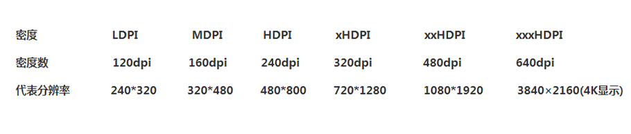

### iOS设备分辨率

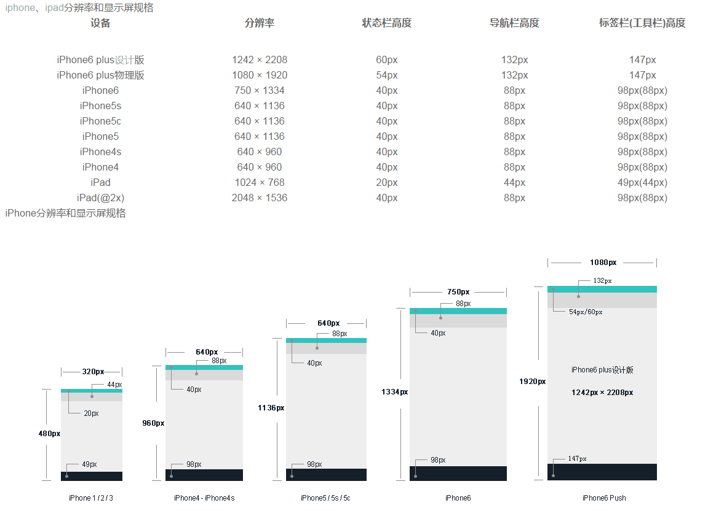
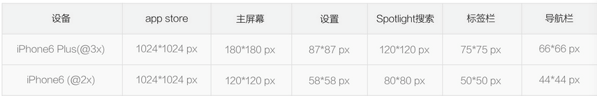

### Apple Watch分辨率

## 设备颜色

### 色彩空间

### 色温

### Gamma值

## 设备独立像素

### 安卓

### iOS

### Mac Retina

## 字体与字体渲染

### 常用字体

### Windows字体渲染机制

### Linux字体渲染机制

### Mac字体渲染机制

## 安卓设计规范
###1.安卓手机
###1.1尺寸规范
#####1.1.1  界面设计尺寸
#####720*1280px
在5种输出的分辨率（MDPI. HDPI.XHDPI.XXHDPI）中按中间值（XHDPI）设计

安卓最小可操作尺寸:48dp,考虑到手指点击的灵敏性的问题，设计可点击控件的时候要考虑到这一点。

**Android的一些开发使用的单位:**
dp：android开发使用的单位，其实相当于一种比例换算单位，它可以保证控件在不同密度的屏幕上按照这个比例单位换算显示相同的效果。
sp：android开发使用的文字单位，和dp差不多，也是为了保证文字在不同密度的屏幕上显示相同的效果。

当屏幕密度为MDPI（160PPI）时，1dp=1px
当屏幕密度为MDPI（160PPI）时，1sp=1px
像素字号=屏幕密度/160 * sp字号  可以根据这个去算算设计稿中的像素字号标注为sp是多少，比如xHDPI下,36px的字标注为sp就是18sp，以此类推。

**Android  dp与 px换算：**
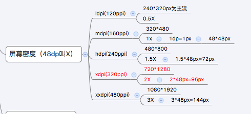
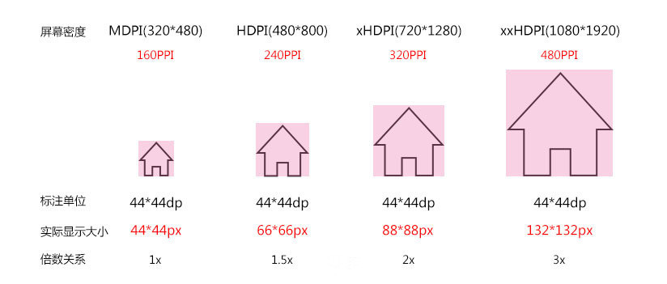
 
#####1.1.2 界面元素尺寸
状态栏：**50px**,导航栏：**96px**,标签栏：**120px**,图标大小**96*96px**。
(注：在安卓中这些控件的高度都能用程序自定义，所以并没有严格的尺寸数值。)
在app的设计中，状态栏＋导航栏高度128px,标签栏120px。

|   屏幕大小     |    启动图标      |   操作栏图标   |    上下文图标  |系统通知图标 |
| -----------   | -------------   | -----------   | ------------- | --------- |
|   320×480px   |    48×48px      |  32×32px      |    16×16px    |  24×24px  |
|   480×800px 480×854px 540×960px    |    72×72px      |  48×48px      |    24×24px    |  36×36px  |
|   720×1280px  |   48×48dp       |  32×32dp      |    16×16dp    |  24×24dp  |
|   1080×1920px |   144×144px     |  96×96px 　　　|   48×48px 　|  72×72px  |

#####1.1.3 字体字号
安卓系统默认的英文字体 **Roboto**,安卓手机的默认中文字体都是**droid sans fallback**,是谷歌自己的字体，
与微软雅黑，方正兰亭黑很像，在app设计中采用的是**方正兰亭**系列字体。

- 标准字 **36px**  用在少数重要标题 
如：导航标题 分类名称
- 标准字 **30px** 用在一些较为重要的文字或操作按钮
如：首页模块名称
- 标准字 **28px** 用于大多数文字
特别适用于大段文字
- 标准字 **26px** 用于大多数文字
如：小标题  模块描述
- 标准字 **24px** 用于辅助性文字
如：次要的副标语等
- 标准字 **22px** 用于辅助性文字
如：次要的备注信息等
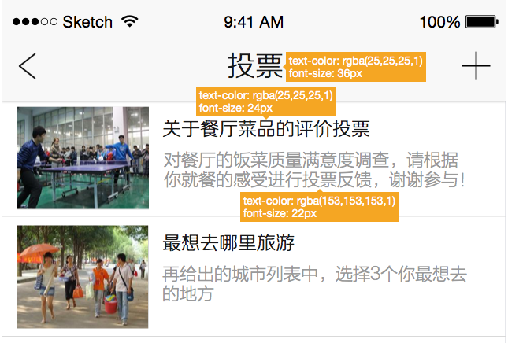
###1.2批量切图
所有设计尺寸，包括图形效果，应该尽量使用**偶数**。
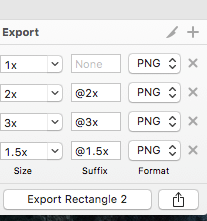
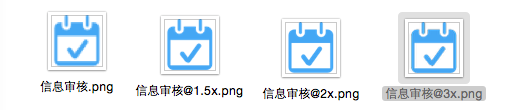

###1.3安卓设计中运用到设计颜色
- 
＃9999999
用于辅助次要的文字信息、普通按钮描边
- 
＃666666
用于普通级段落信息、引导词
- 
＃cccccc
用于分割线、标签描边
- 
＃191919
用于导航标题、分类名称

###1.4标注
#####1.4.1标注规范
若按px为单位标注，需告知开发人员当前标注的密度，开发人员进行换算。若在MDPI（即设计中的320尺寸）下标注，
**1px=1dp=1sp**。
安卓开发中dp为距离单位，sp为字号单位。
在app的标注中，直接用设计的720尺寸（MDPI）效果图标注，则1dp=2px.开发人员将所有标注的px的数值除以2即为dp数。
#####1.4.2标注工具
Mark Man，PxCook，Assistor PS标注都很方便。设计时出现的数值误差都可以手动更改。
需要标注字号、间距、色值。
###2. 安卓Pad
###2.1 尺寸规范
####2.1.1 界面设计尺寸：
#####1280*800px
####2.1.2 界面元素尺寸
在app中，pad开发只用了一套图，所以设计、切图、标注全在**1280*800px**中完成。
###2.2 批量切图
 因为只出一套切图，所以Photoshop完成即可，不需要插件。
 同样规格的切图可以放在一个文件中切图。如48px的切图，新建48*48px文件，把所有icon都放入该文件居中，分别导出即可。
###2.3 标注
#####2.3.1 标注规范：
在**1280*800px**效果图中直接标注。
#####2.3.2 标注工具
Mark Man，PxCook,Assistor Ps标注都很方便。设计时出现的数值误差都可以手动更改。
需要标注字号、间距、色值。

### Material Design综述

## iOS设计规范
###1. 苹果手机
###1.1 尺寸规范
####1.1.1 界面设计尺寸
#####640*1136px
iPhone界面尺寸：**320 × 480  640×960   640×1136**

iPhone6:4.7英寸（**1334 × 750**），iPhone6 Plus:5.5英寸（**1920×1080**）
ps:作图的时候确保都是用形状工具画的，这样更方便后期的切图或者尺寸变更。
####1.1.2界面元素尺寸
iPhone的app界面一般由四个元素组成
分别是：状态栏、导航栏、主菜单栏、内容区域

- 状态栏：高度为**40px**
- 导航栏：高度为**88px**
- 主菜单栏：高度为**98px**
- 内容区域：高度为**910px**

**iphone界面尺寸**

iPhone6+缩减像素取样
在iOS上渲染像素和物理像素（physical pixels）是等同的，只有一个例外：iPhone 6 Plus的Retina HD显示屏。
由于它屏幕的像素分辨率要低于一个常规的@3x分辨率，所以被渲染内容会自动调整为原始尺寸的87%（从2208×1242
像素来适应为1920×1082像素的显示屏分辨率）

####1.1.3字体字号
iPhone上的英文字体为：**helveticaNeue**。至于中文字体，Mac用的是 **黑体** 和 **苹果丽黑**,
其他用 **华文黑体** （最新字体称为**黑体－简**）。

- 标准字 **36px**  用在少数重要标题 
如：导航标题 分类名称
- 标准字 **30px** 用在一些较为重要的文字或操作按钮
如：首页模块名称
- 标准字 **28px** 用于大多数文字
特别适用于大段文字
- 标准字 **26px** 用于大多数文字
如：小标题  模块描述
- 标准字 **24px** 用于辅助性文字
如：次要的副标语等
- 标准字 **22px** 用于辅助性文字
如：次要的备注信息等

###1.2批量切图
所有设计尺寸，包括图形效果，应该尽量使用**偶数**。

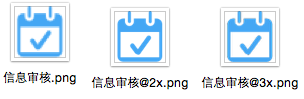
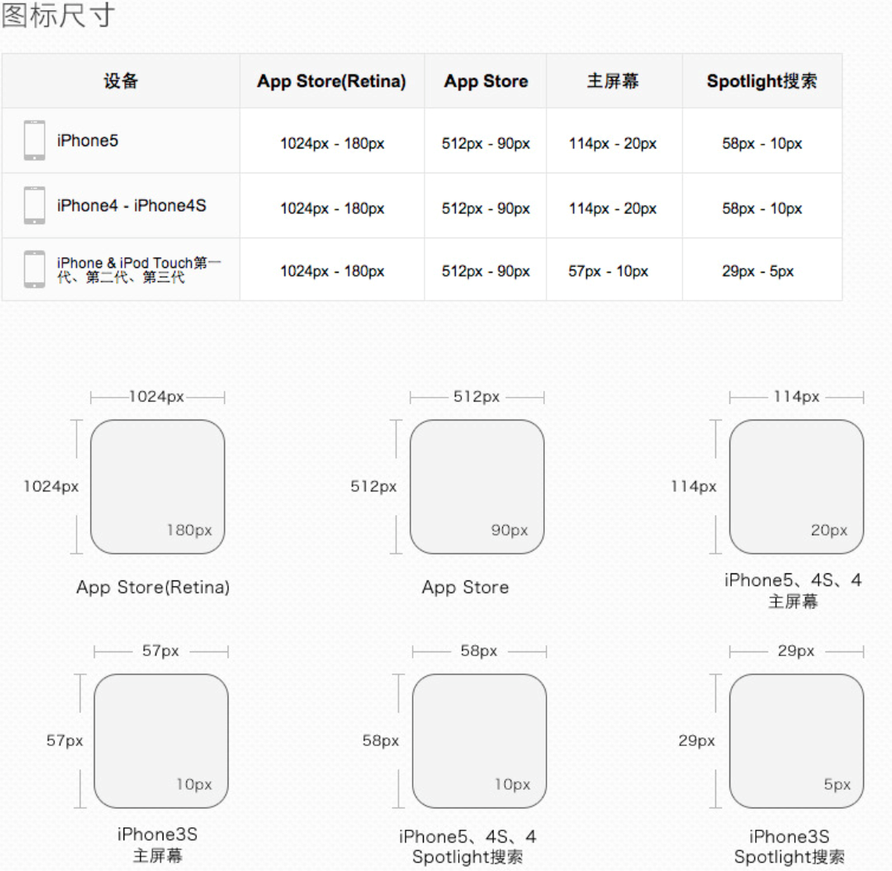

#### iphone icon规格

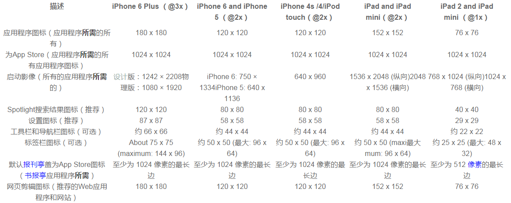
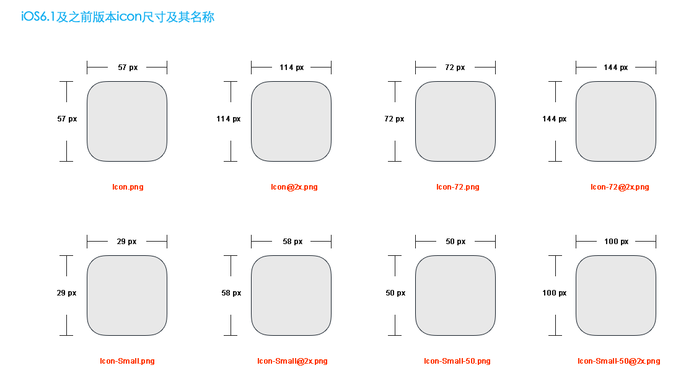

###1.3标注
- 文字需要提供：字体大小（px）,字体颜色。
- 需要提供：顶部标题栏的背景色值。
- 需要提供：内容显示区域的背景色。
- 需要提供：底部的背景色值。

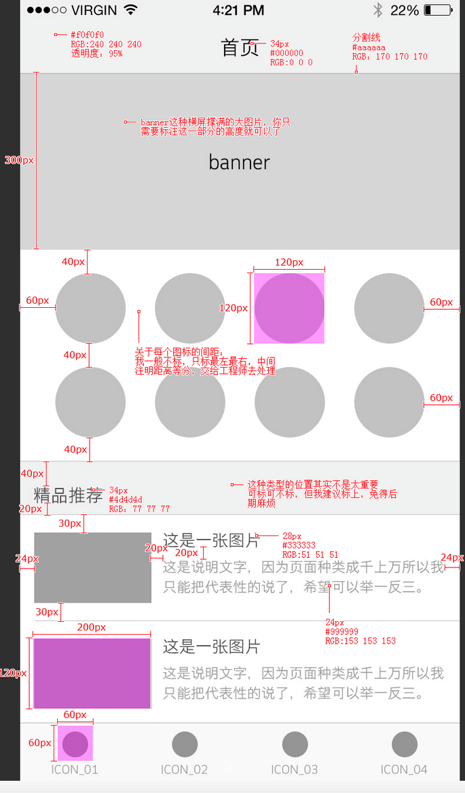
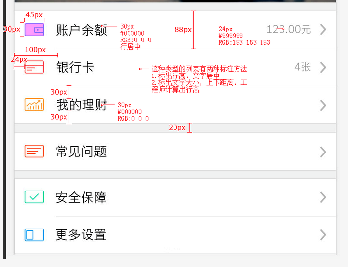

###1.4iOS设计中运用到设计颜色
- 
＃9999999
用于辅助次要的文字信息、普通按钮描边
- 
＃666666
用于普通级段落信息、引导词
- 
＃cccccc
用于分割线、标签描边
- 
＃191919
用于导航标题、分类名称
##2. ipad
###2.1 尺寸规范
#####2048*1536px
状态栏（status bar）:40px
导航栏（navigation）:88px
标签栏高度：98px

 **ipad界面尺寸**

 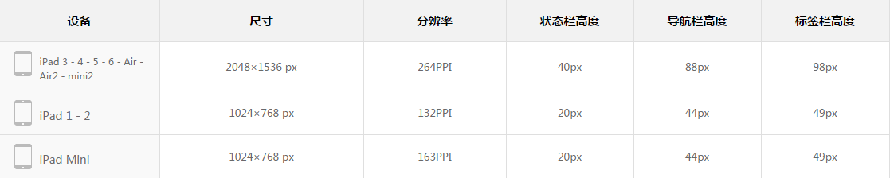
 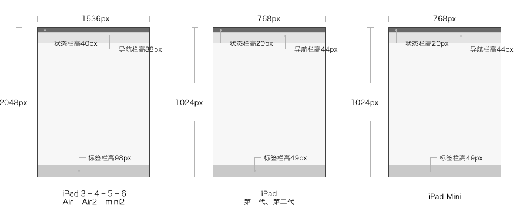

 **ipad图标尺寸**

 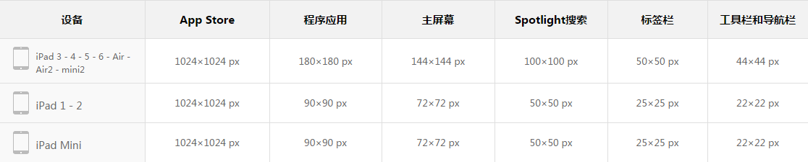
 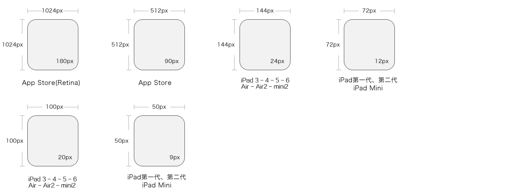

 **ipad icon规格**
 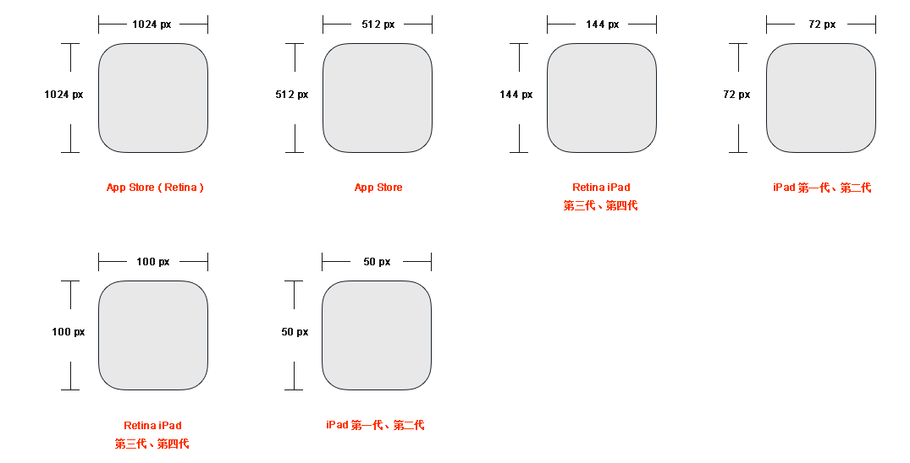
###2.2 标注
- 文字需要提供：字体大小（px）,字体颜色。
- 需要提供：顶部标题栏的背景色值。
- 需要提供：内容显示区域的背景色。
- 需要提供：底部的背景色值。
###2.3 iOS设计中运用到设计颜色
- 
＃9999999
用于辅助次要的文字信息、普通按钮描边
- 
＃666666
用于普通级段落信息、引导词
- 
＃cccccc
用于分割线、标签描边
- 
＃191919
用于导航标题、分类名称
##综述

## Web设计规范
###1.pc端网页的设计尺寸
目前用的设计尺寸:**1366*768**
###2．标准字
在pc端：设计稿中字体为系统默认字体，Mac电脑统一是**苹果丽黑**会更好。
在pc端统一的标准字大小是**12px**。
###3.切图
你的所有设计尺寸，包括图形效果，应该尽量使用**偶数**。
如有需要图片切两套，pc端和移动端。平常pc端就可以。
###4.页面标注
- 文字需要提供：字体大小（px）,字体颜色。
- 需要提供：顶部标题栏的背景色值。
- 需要提供：内容显示区域的背景色。
- 需要提供：控件的大小、间距。

###5.响应式设计
- 响应式设计需要提供给设计师两套原型，PC版本和移动版本各一套，同时提供最终设计效果的参考图。
- 响应式标注 横向按照百分比、像素两种方式标注，纵向按照像素或者图片比例标注，必要时使用hype3制作响应
或交互效果的展示。

## Mac设计规范

## PC设计规范

## 版式设计

## 交互设计规范

## 配色方案

## 动效设计方案

## 流程规范

## 心智模型

## 资源

