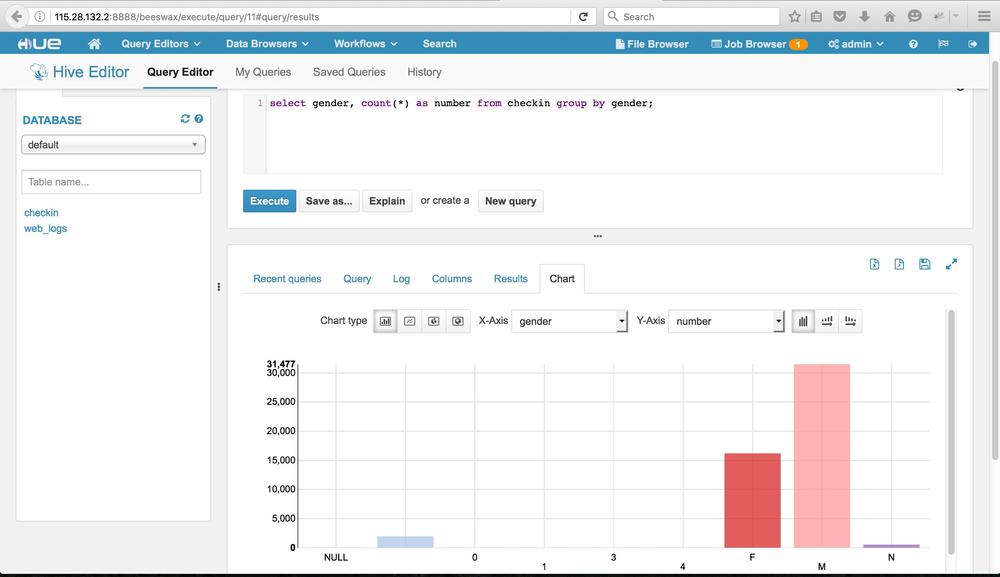

# 五分钟学会云计算

我们以五万条开房记录为例，数据是来自如家的真实信息，总共大概有一千万条。

整篇文档都需要对SQL语言有所了解，更多SQL语言的介绍可见于[《MySQL必知必会》](https://book.douban.com/subject/3354490/)

## 将数据导入mysql

我们仅导入姓名、身份证号、性别、出生日期、家庭住址等五个项。

	CREATE DATABASE IF NOT EXISTS hotel DEFAULT CHARSET utf8;

	USE hotel

	DROP TABLE IF EXISTS `checkin`;

	CREATE TABLE `checkin` (
		`customer_id` INT UNSIGNED NOT NULL AUTO_INCREMENT,
		`customer_name` CHAR(30) NOT NULL,#
		`customer_identification` CHAR(20) NOT NULL,#
		`customer_gender` CHAR(1) NOT NULL,#
		`customer_birthday` INT NOT NULL,#登陆账号
		`customer_hometown` TEXT DEFAULT '',
		PRIMARY KEY (`customer_id`),
		INDEX(`customer_identification`)
	) ENGINE=InnoDB DEFAULT CHARSET=utf8;

我们使用Python将数据导入数据库

	# coding=UTF-8

	import mysql.connector

	inputFile = open("最后5000.csv", 'r', encoding='utf-8')
	print("open file success")

	try:
	    cnx = mysql.connector.connect(host='115.29.35.166', user='root', database="hotel", password="wuliaodedongtian")
	    cursor = cnx.cursor()
	    insert_checkin = ("INSERT INTO checkin "
	                      "(customer_name, customer_identification, customer_gender, customer_birthday, customer_hometown) "
	                      "VALUES(%s, %s, %s, %s, %s)")
	    for line in inputFile:
	        if count >= 1:
	            words = line.split(',')
	            data_temp = (words[0], words[4], words[5], words[6], words[7])
	            cursor.execute(insert_checkin, data_temp)
	            cnx.commit()
	        
	    cursor.close()
	    cnx.close()
	except mysql.connector.Error as err:
	  if err.errno == errorcode.ER_ACCESS_DENIED_ERROR:
	    print("Something is wrong with your user name or password")
	  elif err.errno == errorcode.ER_BAD_DB_ERROR:
	    print("Database does not exist")
	  else:
	    print(err)
	else:
	  cnx.close()

即可将五万条开房数据导入

## HDFS基本操作

打开[Hue控制台](http://115.28.132.2:8888)即可对文件进行操作，用户名admin，密码admin。

## mysql数据导入HDFS

通过ssh连接到云计算的服务器

	ssh root@115.28.132.2 密码Developer199101

运行
	
	root@node1:~# sqoop import --connect jdbc:mysql://115.29.35.166/hotel --username root --password wuliaodedongtian --table checkin --target-dir /yupengfei/hotel

即可将数据导入到HDFS的/yupengfei/hotel目录下，可以使用浏览器看到该文件夹。

## 创建外部表将HDFS中的数据导入Hive

输入hive进入控制台，创建外部表
	
	CREATE EXTERNAL TABLE IF NOT EXISTS Checkin(
	    id INT, 
	    name STRING,
	    identification STRING,
	    gender STRING,
	    birthday INT, 
	    hometown STRING)
	COMMENT 'Data about checkin from a public database'
	ROW FORMAT DELIMITED
	FIELDS TERMINATED BY ','
	STORED AS TEXTFILE
	location '/yupengfei/hotel';

即可开始使用SQL语句进行查询

	select * from Checkin limit 10;

也可使用[Hue控制台](http://115.28.132.2:8888)

一个demo截图如下

## mysql数据导入到HBase

## 创建外部表将HBase的数据导入到Hive

